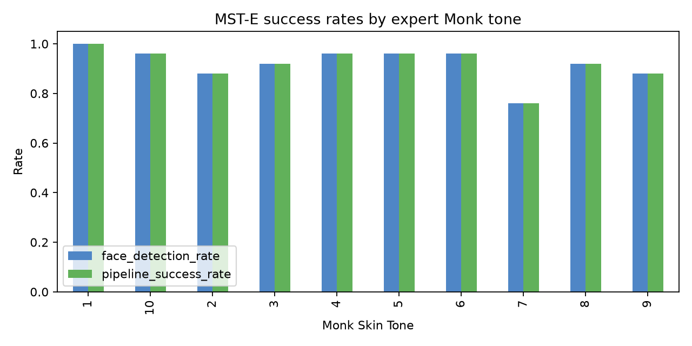
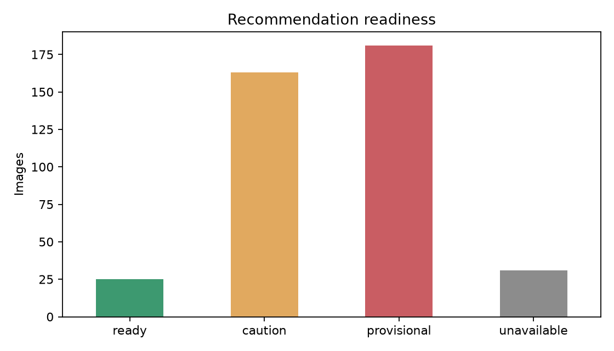
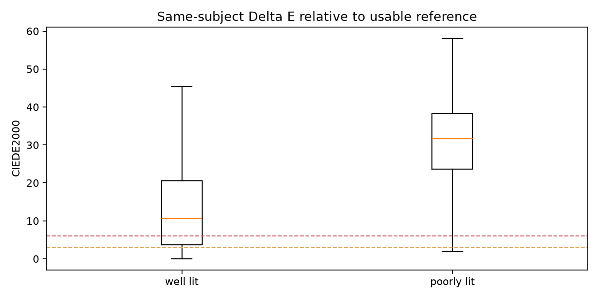

<div align="center">

# ShadeSense AI

**Explainable computer vision for robust foundation shade shortlisting**

[](https://www.python.org/)
[](https://streamlit.io/)
[](https://ai.google.dev/edge/mediapipe/solutions/vision/face_landmarker)
[](https://en.wikipedia.org/wiki/Color_difference#CIEDE2000)
[](#verification)
[](#evaluation)
[](https://abdullahahsen05.github.io/shadesense/reports/)

</div>

ShadeSense AI is a local-first foundation recommendation system. It detects a
face, isolates reliable skin regions, estimates visible skin color under
imperfect capture conditions, and returns three visually distinct catalog
shades with candidate-specific confidence and plain-language reasoning.

The project deliberately uses an explainable computer-vision pipeline instead
of a black-box shade classifier. Every recommendation can be traced back to
facial regions, retained color patches, perceptual distance, uncertainty, and
catalog evidence.

## Assessment Outcomes

| Requirement | ShadeSense AI response |
|---|---|
| Recommend the best matching foundation shade | Ranks catalog candidates with distribution-aware CIEDE2000 distance in Lab color space. |
| Return the Top 3 | Always presents three visually distinct shade families when matching succeeds. |
| Include a confidence score for each recommendation | Computes candidate-specific heuristic confidence below a capture-readiness safety ceiling. |
| Explain each recommendation | Shows color fit, stability, catalog evidence, included/excluded regions, and concise reasoning per result. |

## Demo

```powershell
python -m venv .venv
.\.venv\Scripts\Activate.ps1
pip install -r requirements.txt
python scripts/download_model.py
streamlit run app.py
```

Open the local URL printed by Streamlit, normally
`http://localhost:8501`. Upload one well-lit frontal face photograph, or two to
three independent photographs for multi-photo consensus.

## How It Works


Key technical decisions:

- **Facial evidence, not background brightness.** Exposure and color-cast
  diagnostics operate on the forehead, cheeks, and jaw regions.
- **Contamination-aware masks.** Eyes, brows, lips, nostrils, hairline, central
  chin, and under-chin shadow are avoided; pose, glasses, reflections, facial
  hair, and clipping can reduce or exclude a region.
- **Observed-patch consensus.** An actual retained skin patch anchors the result.
  Resolution-aware patches are compared with CIEDE2000, rejected using robust
  median/MAD thresholds, and capped by region so one cheek cannot silently
  dominate.
- **Explicit uncertainty.** Deterministic stratified bootstrapping reports Lab
  intervals, a 90th-percentile Delta E radius, and shade-family stability.
- **Color-first ranking.** Raw CIEDE2000 remains dominant. Product type, depth,
  and catalog quality can only influence close candidates.
- **Safety-aware communication.** Capture readiness describes whether the photo
  can support matching. Candidate confidence describes the evidence for each
  recommended shade. Neither is presented as a calibrated probability.

## Robustness and Failure Handling

ShadeSense does not treat every detected face or skin-colored pixel as equally
trustworthy. Each risk is detected, mitigated, and reflected in the result:

| Capture challenge | Detection | Mitigation | Effect on the result |
|---|---|---|---|
| Bright or dark background | Lighting is measured again after facial masks exist | Forehead, cheek, and side-jaw pixels replace whole-image statistics | The background does not decide whether face lighting is safe |
| Uneven face lighting | Left/right cheek gap, central/lower-face gap, regional shadows, clipping, and luminance spread | Shadowed regions lose influence; valid darker pixels are retained | Readiness and uncertainty worsen when the two sides cannot corroborate one another |
| Glossy or specular highlights | Low-saturation bright pixels, clipped patches, local contrast, and highlight ratios | Affected patches are rejected and glossy regions are downweighted | Shine cannot silently make the extracted tone or foundation target too light |
| Glasses and lens reflections | Per-eye reflection evidence plus dark/edged bridge evidence | Upper-cheek pixels underneath and beside detected lenses are excluded | Eyewear risk is reported and capture readiness is reduced |
| Angled pose | Landmark asymmetry and visible cheek area | The foreshortened cheek is reduced instead of averaging both cheeks equally | A poorly visible cheek cannot dominate the estimate |
| Region disagreement | Forehead and jaw colors are compared with the cheek anchor using CIEDE2000 | A contaminated forehead may be excluded; an unsupported jaw becomes diagnostic-only | Included, excluded, and reduced-weight regions are shown with reasons |
| Makeup, facial hair, or local occlusion | Valid-pixel ratio, local color variation, stable-patch evidence, and cheek disagreement | Suspect patches or regions are rejected or downweighted | The result relies on the remaining independently supported regions |
| Low facial color signal | Face-region shadow, black clipping, exposure, usable area, and extraction stability | Recommendation readiness is forced to `provisional` | Top 3 remain visible, confidence is capped at 55%, and recapture is recommended |

The order of operations is intentional:

```text
global lighting check
-> provisional conservative correction for landmark stability
-> face landmarks and masks
-> face-region lighting analysis
-> final conservative correction
-> robust patch extraction
```

The nose is deliberately excluded because it is a curved central highlight zone
with frequent redness and nostril shadow. Cheeks are the primary evidence;
forehead and side jaw provide independent support. The side jaw is preferred to
the full central chin because the under-lip and under-chin areas are commonly
affected by facial hair, expression, contour, and cast shadow.

## How the Top 3 Shades Are Selected

The final recommendation is not a nearest-HEX lookup:

1. The measured visible tone and any evidence-supported foundation target are
   converted to Lab.
2. Every in-scope catalog shade is compared with CIEDE2000.
3. Ranking combines the central distance with the median and 90th-percentile
   distances across patch-bootstrap and conservative lighting variations. This
   favors a shade that stays close, not one that wins only for a single point
   estimate.
4. Depth, an uncertainty-aware too-light safeguard, product type, and catalog
   quality may adjust only candidates inside a close-color window. They cannot
   move a clearly worse CIEDE2000 match ahead of a clearly better one.
5. Duplicate variants of the same product/shade are grouped.
6. Perceptually close colors across products form a **shade family**. The
   best-ranked representative of each family is considered before another
   near-duplicate from a family already shown.
7. The display selector progressively enforces perceptual separation so the
   Top 3 provide useful alternatives rather than three nearly identical catalog
   entries.

### Exact-product stability versus shade-family stability

The app reports two related but different signals:

- **Exact-product stability** asks how often the same catalog SKU remains in
  Top 1 or Top 3 across patch-bootstrap and lighting variations.
- **Shade-family stability** asks how often that SKU, or a perceptually
  near-equivalent shade, remains represented in Top 1 or Top 3.

An exact shade can therefore have **low exact-product stability but high family
stability**. This happens when tiny plausible changes in extracted Lab cause
several nearly identical catalog SKUs to exchange positions. The precise product
is ambiguous, but the underlying color neighborhood is stable.

That distinction prevents catalog duplication from making a sound color-family
recommendation look unreliable. Candidate confidence prefers Top-3
shade-family stability, while color fit remains the dominant factor and capture
readiness remains the ceiling. High family stability does not claim that one
named SKU is physically proven correct; it says that the recommended color
family is robust to the measured uncertainty.

## Confidence Semantics

Capture readiness and per-shade confidence answer different questions:

1. **Capture readiness:** Can this photograph support a recommendation?
2. **Candidate confidence:** How strong is the evidence for this particular
   shade, given the capture ceiling?

Candidate evidence uses the available signals with normalized weights:

```text
color_fit = exp(-distribution_aware_delta_e / 15)

candidate_evidence =
    65% color fit
  + 25% shade-family Top-3 stability
  + 10% catalog evidence

candidate_confidence =
    capture_readiness_cap * candidate_evidence
```

Missing evidence is omitted and the remaining weights are renormalized rather
than silently replaced with zero. Readiness caps are at most 93% for `ready`,
75% for `caution`, and 55% for `provisional` captures.

## Evaluation

**[Open the public evaluation report site](https://abdullahahsen05.github.io/shadesense/reports/)**
· [Final 400-image HTML report](https://abdullahahsen05.github.io/shadesense/reports/final-400-image-run/report.html)
· [Versioned report files](reports/)

### Frozen 400-image robustness benchmark

The final run evaluated a deterministic manifest of **400 images**:

- 250 images from MST-E, balanced at 25 images for each expert Monk Skin Tone;
- 150 adult FairFace validation images;
- no benchmark image was used to train or fine-tune the pipeline.

| Metric | Final result |
|---|---:|
| Images evaluated | 400 |
| Face detection / pipeline success | 92.25% |
| Successful extractions | 369 |
| Median extraction quality | 68.69 / 100 |
| Median capture uncertainty | 6.66 Delta E |
| 90th-percentile capture uncertainty | 15.43 Delta E |
| Readiness distribution | 25 ready / 163 caution / 181 provisional / 31 unavailable |
| Median processing time | 8.78 seconds per image |



The benchmark covers every expert Monk Skin Tone level. The subgroup report
also audits lighting, pose, age, gender, glasses, masks, and source dataset.
Failure cases remain visible rather than being removed from the denominator.



The conservative readiness distribution is intentional: weak captures remain
visible as `provisional` instead of receiving an unjustifiably confident shade.



Same-subject repeatability exposes the remaining sensitivity to illumination.
Poorly lit photographs show wider color variation, which is reflected in
readiness warnings and lower confidence.

### Multi-photo consensus

On 19 MST-E identities with a held-out reference image:

| Metric | Result |
|---|---:|
| Median individual-photo distance to reference | 21.26 Delta E |
| Median consensus distance to reference | 11.24 Delta E |
| Median improvement | 5.98 Delta E |
| Subjects improved | 52.6% |

The reference photograph was never included in consensus inputs. This evaluates
repeatability, not physical foundation correctness.

### Candidate-confidence validation

A separate seven-photo real-capture audit produced 21 recommendations:

- every image showed at least a one-percentage-point confidence spread;
- mean Top-3 spread was 9.8 percentage points;
- every confidence obeyed its readiness ceiling;
- all stability evidence was computed at shade-family level;
- catalog evidence varied across candidates instead of acting as a constant.

This validates that confidence is candidate-specific rather than one repeated
session score. Ranking remains color-first, so a lower-ranked shade can
occasionally have slightly stronger stability without replacing the closer
CIEDE2000 match.

### How the evidence maps to the evaluation criteria

| Evaluation criterion | Evidence in this project |
|---|---|
| Accuracy of shade recommendations | Lab/CIEDE2000 matching, distribution-aware distance, foundation-only default scope, uncertainty-aware lightness safeguards, and three distinct shade families. |
| Robustness across skin tones and lighting | Frozen 400-image benchmark, all 10 expert Monk Skin Tone levels, FairFace cross-source images, lighting/pose/eyewear subgroups, readiness gating, and multi-photo consensus. |
| AI and computer-vision approach | MediaPipe landmarks, facial masks, face-aware illumination analysis, adaptive skin filtering, perceptual medoid/MAD consensus, bootstrapping, and stability analysis. |
| Problem-solving and technical decisions | Explicit fallbacks, contamination-driven region weighting, close-match-only metadata effects, product-type parsing, privacy-safe reporting, and honest failure accounting. |
| Explanation and reasoning | Debug overlays, per-region evidence, included/excluded-region reasons, uncertainty diagnostics, confidence breakdowns, and concise recommendation explanations. |

### What this evaluation does and does not prove

The benchmark supports claims about **face detection, extraction coverage,
subgroup behavior, uncertainty, capture readiness, and same-person
repeatability**. It does **not** establish clinically calibrated color accuracy
or real-world wear-test accuracy against physically measured foundation
swatches. MST-E and FairFace do not contain verified matches to this exact
product catalog, and public catalog HEX values are website-derived
approximations.

The complete GitHub-safe evidence package is available as
clickable [public HTML reports](https://abdullahahsen05.github.io/shadesense/reports/)
and in
[`docs/evaluation/final-400-image-run`](docs/evaluation/final-400-image-run/README.md).
The final report package includes its charts, aggregate JSON, subgroup CSV, and
reproducibility notes.
The full local run also generated 369 face-overlay images and per-image records;
those are intentionally not committed because they contain dataset faces and
may be subject to source-dataset licenses.

## Shade Catalog

`data/public_shade_catalog.csv` is the default catalog. It is built from public
website-derived color records and normalized into a flexible schema. The UI
defaults to genuine foundations; tints, BB/CC products, cushions, powders,
sticks, and concealer hybrids can be included through product scope.

```powershell
python scripts/prepare_public_catalog.py
```

The small `data/shade_catalog_mock.csv` remains a development fallback. Catalog
HEX values approximate online swatches and cannot calibrate physical
foundation appearance, finish, oxidation, or camera rendering.

## Project Structure

```text
app.py                                  Streamlit presentation layer
src/analysis_pipeline.py                Shared app/evaluation pipeline
src/face_detection.py                   MediaPipe detection and landmarks
src/region_masks.py                     Forehead, cheek, and side-jaw masks
src/skin_extraction.py                  Patch evidence and robust consensus
src/capture_uncertainty.py              Systematic capture uncertainty
src/shade_matcher.py                    CIEDE2000 catalog ranking
src/confidence.py                       Candidate-confidence semantics
src/multi_photo_consensus.py            Multi-capture aggregation
scripts/evaluate_dataset.py             Frozen-manifest evaluation harness
scripts/evaluate_multi_photo.py         Held-out repeatability evaluation
docs/evaluation/                        GitHub-safe evaluation evidence
tests/                                  Unit, regression, and Streamlit smoke tests
```

## Reproduce the Evaluation

Dataset archives are not redistributed. After downloading the source datasets,
build a frozen manifest and run the shared pipeline:

```powershell
python scripts/build_evaluation_manifest.py `
  --datasets-root "C:\path\to\datasets" `
  --output data/evaluation/benchmark_manifest.csv

python scripts/evaluate_dataset.py `
  --manifest data/evaluation/benchmark_manifest.csv `
  --output outputs/evaluation/my-run `
  --run-label my-run `
  --resume

python scripts/evaluate_multi_photo.py `
  --results outputs/evaluation/my-run/per_image_results.csv `
  --output outputs/evaluation/my-run/multi_photo
```

The app and harness both call `src.analysis_pipeline.analyze_rgb_image`, which
prevents a separate, easier benchmark implementation from diverging from the
demo path. See
[`docs/evaluation_methodology.md`](docs/evaluation_methodology.md) for split,
licensing, and metric details.

## Verification

```powershell
python -m compileall src scripts app.py
pytest tests/ -q
```

Current verified state: **224 tests passing**, including color conversion,
masks, face-aware lighting, robust extraction, bootstrapping, matching,
readiness, candidate confidence, multi-photo consensus, evaluation reporting,
and Streamlit smoke coverage.

## Known Limitations

- Web catalog colors are approximations rather than measured physical swatches.
- Camera auto-exposure, white balance, HDR, beauty filters, makeup, and display
  rendering can shift observed color.
- Strong shadows, oblique pose, facial-hair contamination, masks, and reflective
  eyewear can force a provisional result or prevent extraction.
- Confidence is an evidence-based heuristic, not a probability that a shade
  will match in person.
- Physical accuracy requires a labeled validation set containing faces and
  verified matches from the exact demonstration catalog.

See [`docs/limitations.md`](docs/limitations.md) for the full boundary of the
system's claims.

## Privacy

Analysis runs locally. The application does not upload photographs to a remote
service, store user accounts, or scrape live product websites at runtime.
